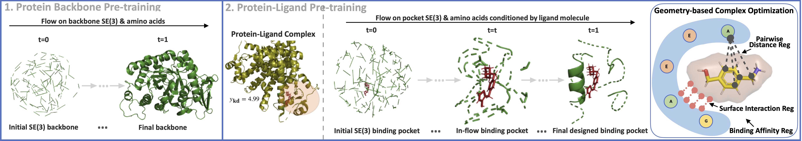

# EnzymeFlow Hierarchical Pre-training



## Pre-training on PDBBind2020

1. Download PDBBind2020 data from [link](https://www.pdbbind-plus.org.cn/download), then put pocket data under ./data/pdb folder.

2. Run process_data.py to process rawdata to metadata.

   (a) read [pocket rawdata](https://github.com/WillHua127/EnzymeFlow/tree/main/Pretrain/data/pdb) (pocket pdb and ligand mol2 files) from ./data/pdb.
   
   (b) [pocket metadata](https://github.com/WillHua127/EnzymeFlow/tree/main/Pretrain/data/processed) will be saved into ./data/processed.
   
   (c) [metadata.csv](https://github.com/WillHua127/EnzymeFlow/blob/main/Pretrain/data/metadata.csv) will be saved into ./data along with a label file [kdvalue.csv](https://github.com/WillHua127/EnzymeFlow/blob/main/Pretrain/data/kdvalue.csv).
   
   (d) a toy [example](https://github.com/WillHua127/EnzymeFlow/tree/main/Pretrain/data/pdb/6nvl) is provided.

3. configs.py contain all pre-training configurations and hyperparameters.

4. Train model using train_ddp.py for parallal training with multi-gpus (we trained with 4gpus).
```bash
CUDA_VISIBLE_DEVICES=0,1,2,3 python -m torch.distributed.launch --nproc_per_node=4 train_ddp.py
```

## After pre-training

1. Training loggings will be saved into ./logger folder.

2. Pre-trained model will be saved into ./checkpoint folder.

3. Generated samples will be saved into ./generated folder.

4. Fine-tune pre-trained model on enzyme catalytic pockets.
