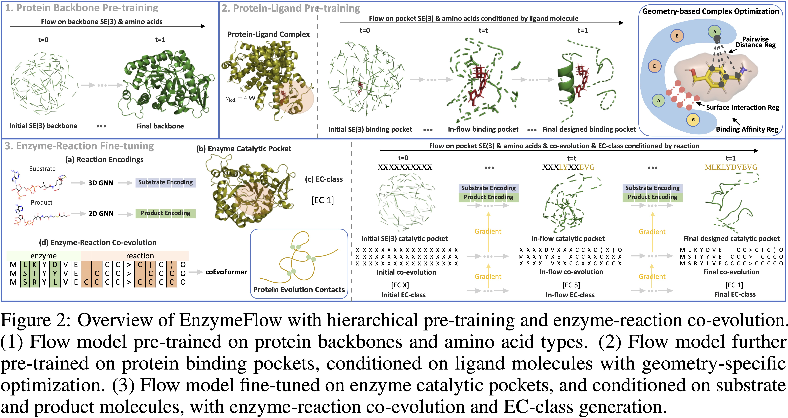
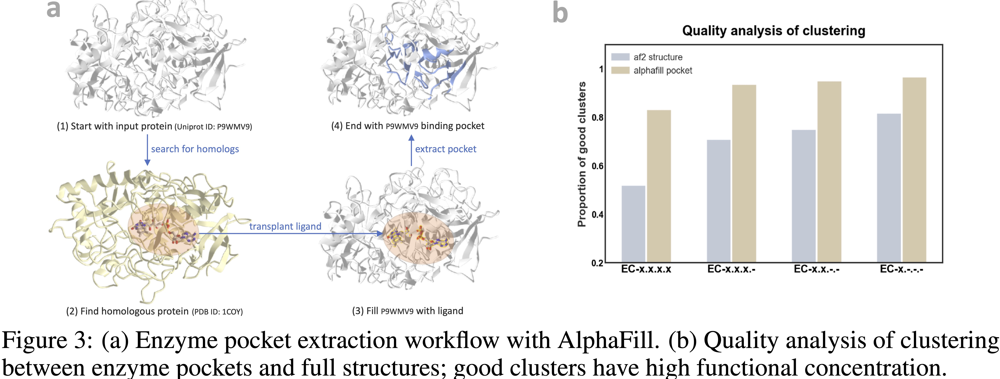

# EnzymeFlow

## Model

## Data

1. In this github, we provide [rawdata](https://github.com/WillHua127/EnzymeFlow/blob/main/data/rawdata_cutoff-0.4.csv) and [metadata](https://github.com/WillHua127/EnzymeFlow/blob/main/data/metadata_cutoff-0.4.csv) with 40% homologys in ./data folder. More rawdata can be downloaded at link.

2. Process rawdata into metadata by using process_data.py.

## Further Statistics

